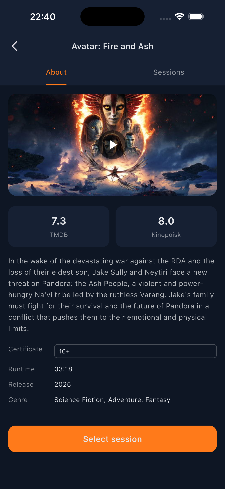
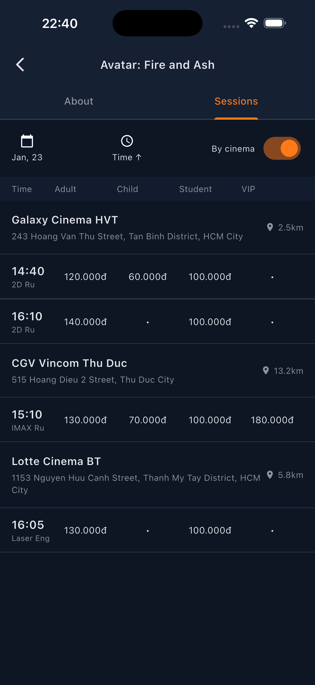
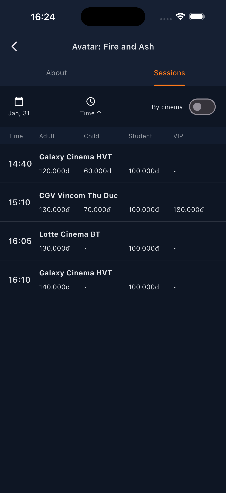
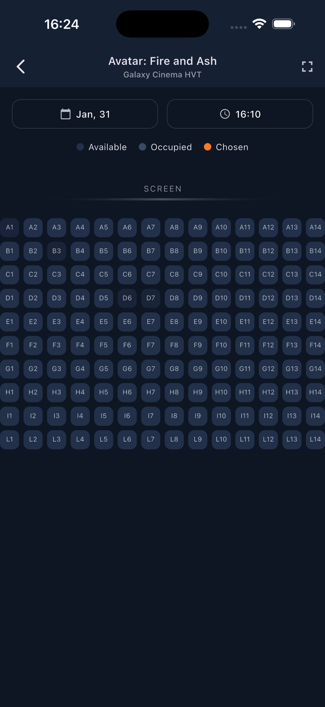
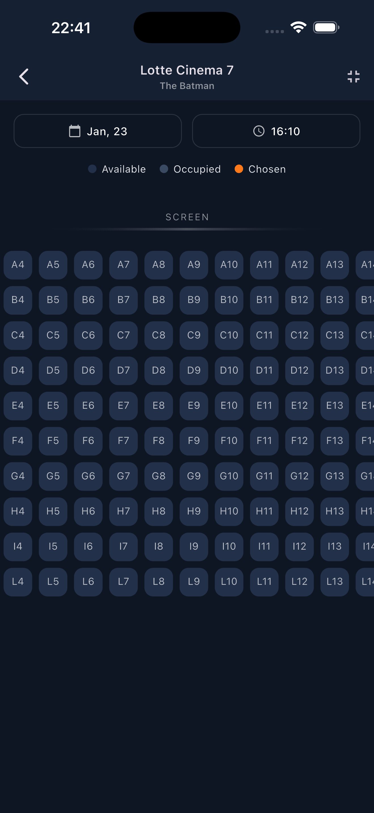
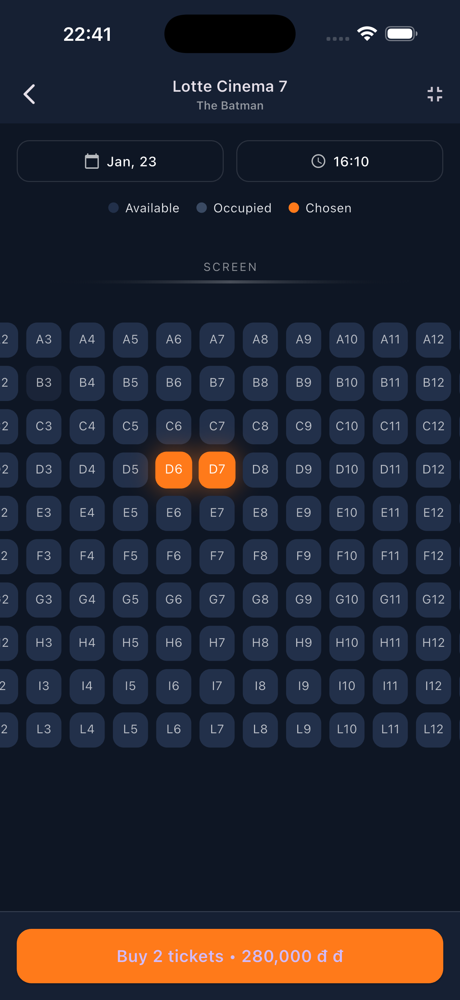
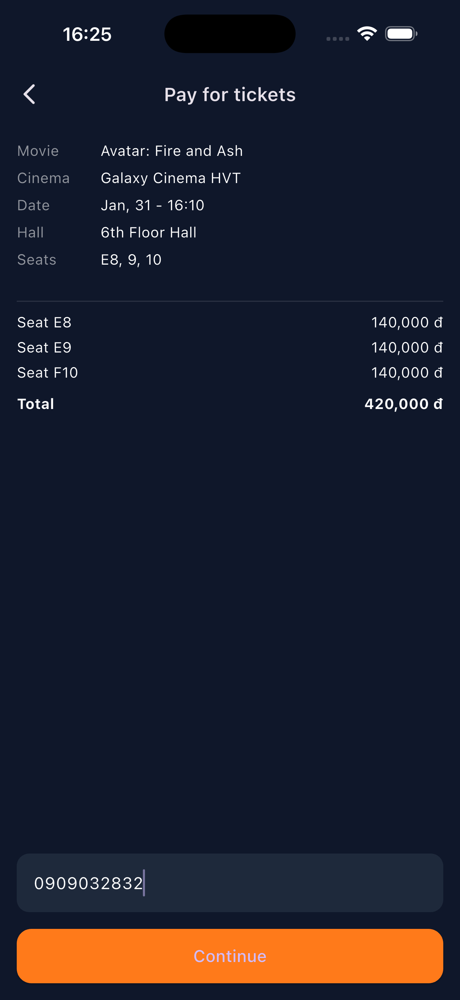
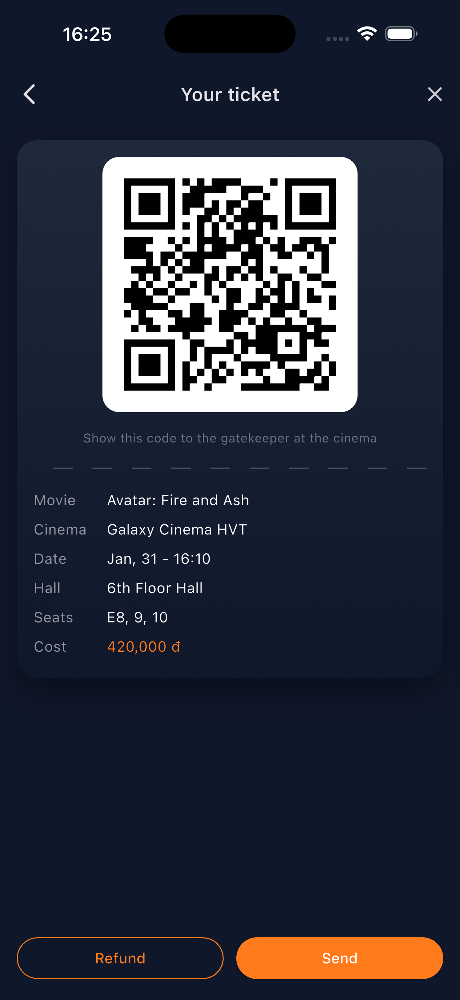

# 🎬 CineGo – Cinema Ticket Booking App (Flutter)

CineGo is a Flutter-based cinema ticket booking application focusing on
clean architecture, scalable state management, and a complete booking flow UI.

> 📌 This project is intentionally stopped at the **Fake Ticket Demo** stage
> for learning, architectural practice, and portfolio purposes.

---

## ✨ Features

- Browse movies & showtimes (mock data)
- Seat selection with visual seat map
- Booking flow: Seat → Payment → Ticket
- Fake Ticket generation for demo
- Clean Architecture (Domain / Data / Presentation)
- BLoC / Cubit state management

---

## 🧱 Architecture

This project follows **Clean Architecture** principles:
```text
lib
├── app.dart
├── core
│   ├── bloc
│   ├── cache
│   ├── constants
│   ├── core.dart
│   ├── database
│   ├── di
│   ├── error
│   ├── extensions
│   ├── l10n
│   ├── navigation
│   ├── network
│   ├── observer
│   ├── theme
│   └── utils
├── features
│   ├── booking
│   │   ├── data
│   │   │   ├── datasources
│   │   │   ├── mappers
│   │   │   ├── models
│   │   │   └── repositories
│   │   ├── domain
│   │   │   ├── entities
│   │   │   ├── repositories
│   │   │   ├── results
│   │   │   └── usecases
│   │   └── presentation
│   │       ├── bloc
│   │       ├── enums
│   │       ├── mappers
│   │       ├── models
│   │       ├── screens
│   │       └── widgets
│   ├── genre
│   │   ├── data
│   │   │   ├── datasources
│   │   │   ├── dtos
│   │   │   ├── mappers
│   │   │   ├── repositories
│   │   │   └── responses
│   │   └── domain
│   │       ├── entities
│   │       ├── repositories
│   │       └── usecases
│   ├── movie
│   │   ├── data
│   │   │   ├── datasources
│   │   │   ├── dtos
│   │   │   ├── mappers
│   │   │   ├── models
│   │   │   └── repositories
│   │   ├── domain
│   │   │   ├── entities
│   │   │   ├── repositories
│   │   │   └── usecases
│   │   └── presentation
│   │       ├── bloc
│   │       ├── cubit
│   │       ├── mappers
│   │       ├── models
│   │       ├── screens
│   │       └── widgets
│   └── payment
│       ├── data
│       │   ├── datasources
│       │   ├── mappers
│       │   ├── models
│       │   └── repositories
│       ├── domain
│       │   ├── entities
│       │   ├── repositories
│       │   └── usecases
│       └── presentation
│           ├── screens
│           └── widgets
├── env.dart
├── env.g.dart
└── main.dart
```

State management is handled using **flutter_bloc (Cubit & Bloc)**.

---

## 🎟 Booking Flow (Demo)

1. Select movie & showtime
2. Choose seats
3. Fake payment confirmation
4. Display fake ticket screen

> ⚠️ No real payment, backend, or seat locking system is implemented.

---

## 🧪 Data & Limitations

- All data (movies, showtimes, seats) are **mocked**
- No authentication
- No real backend or database sync
- Seat locking is simulated only for UI demonstration

---

## 🛑 Project Status

🚧 **Stopped – Fake Ticket Demo Completed**

This project will not be further developed unless used as a base
for backend or real-time booking experiments.

---

## 🚀 Installation & Usage

```bash
git clone https://github.com/USERNAME/CineGo.git
cd CineGo
flutter pub get
flutter pub run build_runner build --delete-conflicting-outputs
flutter run
```

---

## 📦 Tech Stack

- Flutter
- Dart
- flutter_bloc
- Clean Architecture
- Drift (local DB - experimental)
- TMDB API (exploration only)

---

## 📸 Screenshots

<p align="center">
  
  
  
</p>

<p align="center">
  
  
</p>

<p align="center">
  
  
  
</p>

<p align="center">
  
  
</p>

---

## 🎥 Demo Video

This video demonstrates the complete booking flow:

- Seat selection
- Fake payment confirmation
- Fake ticket generation

▶️ Watch the full booking flow demo here:  
https://github.com/user-attachments/assets/36b08f45-32b6-4bcc-a4a2-b002027ed50f

---

## 👤 Author

**Phu Quy**  
Flutter Developer  
📍 Vietnam

---

## 📄 License

This project is licensed under the MIT License.
